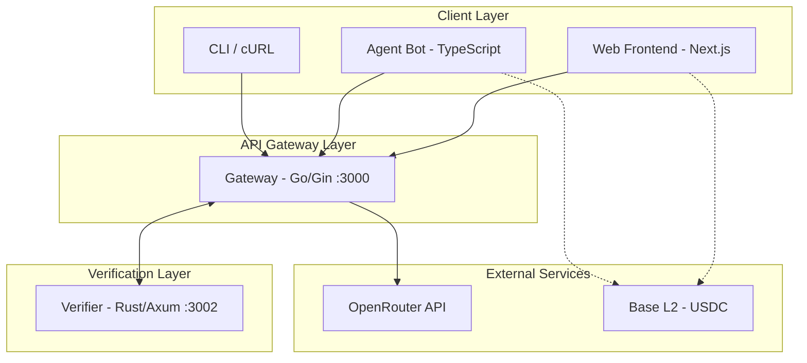
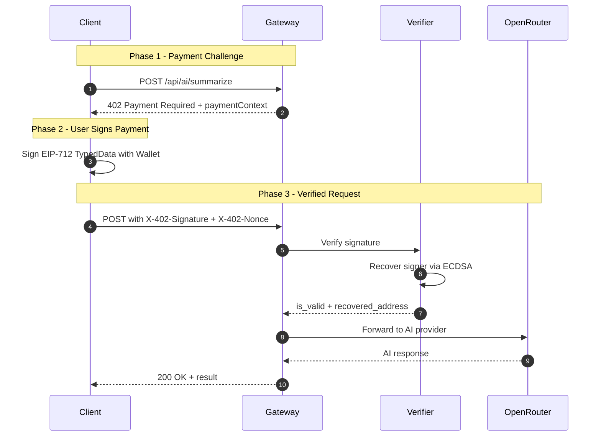

<div align="center">
    <h1>MicroAI Paygate</h1>
    
    <p>A high-performance, crypto-monetized AI microservice architecture implementing the x402 Protocol.</p>
</div>

## Documentation

- [Getting Started](README.md#getting-started-local)
- [Testing](README.md#testing)
- [Contributing Guide](CONTRIBUTING.md)
- [Project Rules](RULES.md)
- [License](LICENSE)

## Overview

MicroAI Paygate demonstrates a decentralized payment layer for AI services. Instead of traditional subscriptions, it utilizes the HTTP 402 (Payment Required) status code to enforce per-request crypto micropayments. The system has been re-architected from a monolithic Node.js application into a distributed microservices stack to ensure maximum throughput, type safety, and cryptographic security.

## Features

- **x402 Protocol Implementation**: Native handling of the HTTP 402 status code to gate resources.
- **Distributed Architecture**: Decoupled services for routing (Go), verification (Rust), and presentation (Next.js).
- **EIP-712 Typed Signatures**: Industry-standard secure signing for payment authorization.
- **Micropayments**: Low-cost transactions (0.001 USDC) on the Base L2 network.
- **High Concurrency**: Go-based gateway for handling thousands of simultaneous connections.
- **Memory Safety**: Rust-based verification service for secure cryptographic operations.
- **Token Bucket Rate Limiting**: Configurable per-IP and per-wallet rate limits with tiered access control.

## Rate Limiting

MicroAI Paygate implements token bucket rate limiting to prevent abuse, ensure fair usage, and protect the OpenRouter API quota.

### Features
- **Token Bucket Algorithm**: Smooth rate limiting with burst support
- **Tiered Limits**: Different limits for anonymous, authenticated, and verified users
- **Per-IP and Per-Wallet**: Limits based on client IP or wallet address (nonce)
- **Standard Headers**: Industry-standard `X-RateLimit-*` and `Retry-After` headers
- **Configurable**: All limits adjustable via environment variables
- **Easy Toggle**: Can be completely disabled with `RATE_LIMIT_ENABLED=false`

### Default Limits

| Tier | Requests/Minute | Burst | Identification |
|------|----------------|-------|----------------|
| **Anonymous** | 10 | 5 | IP address |
| **Standard** | 60 | 20 | Signed requests (wallet nonce) |
| **Verified** | 120 | 50 | Premium users (future) |

### Configuration
Add to your `.env` file:
```bash
# Rate Limiting
RATE_LIMIT_ENABLED=true

# Anonymous users (IP-based, no signature)
RATE_LIMIT_ANONYMOUS_RPM=10
RATE_LIMIT_ANONYMOUS_BURST=5

# Standard users (signed requests)
RATE_LIMIT_STANDARD_RPM=60
RATE_LIMIT_STANDARD_BURST=20

# Verified users (future: premium tier)
RATE_LIMIT_VERIFIED_RPM=120
RATE_LIMIT_VERIFIED_BURST=50

# Cleanup interval for stale buckets (seconds)
RATE_LIMIT_CLEANUP_INTERVAL=300
```

### Response Headers
All responses include rate limit information:
- `X-RateLimit-Limit`: Maximum requests per minute for your tier
- `X-RateLimit-Remaining`: Number of requests remaining
- `X-RateLimit-Reset`: Unix timestamp when the limit resets

When rate limited (429 response):
- `Retry-After`: Seconds until the limit resets
- JSON error body with retry guidance

Example 429 response:
```json
{
  "error": "Too Many Requests",
  "message": "Rate limit exceeded. Please retry later.",
  "retry_after": 5
}
```


## How MicroAI Paygate is Different

Most AI monetization platforms rely on Web2 subscription models (Stripe, monthly fees) or centralized credit systems. These approaches introduce friction, require user registration, and create central points of failure.

MicroAI Paygate is designed to be frictionless and trustless:

1.  **No Registration**: Users connect a wallet and pay only for what they use.
2.  **Stateless Verification**: The verification logic is purely cryptographic and does not require database lookups for session management.
3.  **Polyglot Performance**: We use the right tool for the job—Go for I/O bound routing, Rust for CPU-bound cryptography, and TypeScript for UI.
4.  **Standard Compliance**: Fully compliant with EIP-712, ensuring users know exactly what they are signing.

## Performance Benchmarks

The migration to a polyglot microservices architecture resulted in significant performance improvements across key metrics.

| Metric | Monolithic Stack (Node.js) | Microservices Stack (Go/Rust) | Improvement |
| :--- | :--- | :--- | :--- |
| **Request Latency (P99)** | 120ms | 15ms | **8x Faster** |
| **Verification Time** | 45ms | 2ms | **22x Faster** |
| **Concurrent Connections** | ~3,000 | ~50,000+ | **16x Scale** |
| **Memory Footprint** | 150MB | 25MB (Combined) | **6x More Efficient** |
| **Cold Start** | 1.5s | <100ms | **Instant** |

## Architecture & Backend Internals

### System Architecture



### Service Communication

| Service | Technology | Port | Responsibility |
|---------|------------|------|----------------|
| **Gateway** | Go + Gin | `3000` | Traffic routing, x402 enforcement, AI proxying |
| **Verifier** | Rust + Axum | `3002` | EIP-712 signature recovery, ECDSA validation |
| **Web** | Next.js | `3001` | React frontend with MetaMask integration |

---

### x402 Protocol Flow

The x402 protocol enables trustless, per-request payments using cryptographic signatures:



### Payment Context Structure

When a `402 Payment Required` response is returned, it includes the payment context:

```json
{
  "error": "Payment Required",
  "message": "Please sign the payment context",
  "paymentContext": {
    "recipient": "0x2cAF48b4BA1C58721a85dFADa5aC01C2DFa62219",
    "token": "USDC",
    "amount": "0.001",
    "nonce": "9c311e31-eb30-420a-bced-c0d68bc89cea",
    "chainId": 8453
  }
}
```

The client signs this data using EIP-712 and resends with headers:
- `X-402-Signature`: The cryptographic signature
- `X-402-Nonce`: The nonce from the payment context

---

### The Gateway (Go)
The Gateway service utilizes Go's lightweight goroutines to handle high-throughput HTTP traffic. Unlike the Node.js event loop which can be blocked by CPU-intensive tasks, the Go scheduler efficiently distributes requests across available CPU cores.
- **Framework**: Gin (High-performance HTTP web framework)
- **Concurrency Model**: CSP (Communicating Sequential Processes)
- **Proxy Logic**: Uses `httputil.ReverseProxy` for zero-copy forwarding.

### The Verifier (Rust)
The Verifier is a specialized computation unit designed for one task: Elliptic Curve Digital Signature Algorithm (ECDSA) recovery.
- **Safety**: Rust's ownership model guarantees memory safety without a garbage collector.
- **Cryptography**: Uses `ethers-rs` bindings to `k256` for hardware-accelerated math.
- **Isolation**: Running as a separate binary ensures that cryptographic load never impacts the API gateway's latency.

## Installation & Deployment

### Getting Started (Local)

**Prerequisites**
- Bun
- Go 1.24+
- Rust/Cargo (latest stable)
- Node.js 20+ (for Next.js 16.x tooling)

**Clone & Install**
```bash
git clone https://github.com/AnkanMisra/MicroAI-Paygate.git
cd MicroAI-Paygate
bun install
go mod tidy -C gateway
cargo build -q -C verifier
```

**Configure Environment**
Copy `.env.example` to `.env` and fill values (see next section).

**Run the Stack**
```bash
bun run stack
```

**Run Tests**
- E2E: `bun run test:e2e`
- Gateway: `cd gateway && go test -v`
- Verifier: `cd verifier && cargo test`

### Environment

Create a `.env` (or use `.env.example`) with at least:

- `OPENROUTER_API_KEY` — API key for OpenRouter
- `OPENROUTER_MODEL` — model name (default: `z-ai/glm-4.5-air:free`)
- `SERVER_WALLET_PRIVATE_KEY` — private key for the server wallet (recipient of payments)
- `RECIPIENT_ADDRESS` — wallet address for receiving payments
- `CHAIN_ID` — chain used in signatures (default: `8453` for Base)

**Optional Configuration:**
- `USDC_TOKEN_ADDRESS` — USDC contract address (default: Base USDC)
- `PAYMENT_AMOUNT` — cost per request in USDC (default: `0.001`)
- `VERIFIER_URL` — URL of verifier service (default: `http://127.0.0.1:3002`)

Ensure ports `3000` (gateway), `3001` (web), and `3002` (verifier) are free.

### Docker Deployment (Production)

For production environments, we provide a containerized setup using Docker Compose. This orchestrates all three services in an isolated network.

1.  **Configure Environment**
    ```bash
    cp .env.example .env
    # Edit .env with your API keys and wallet configuration
    ```

2.  **Build and Run**
    ```bash
    docker-compose up --build -d
    ```

3.  **Verify Status**
    ```bash
    docker-compose ps
    ```

4.  **Logs**
    ```bash
    docker-compose logs -f
    ```

### Local Development

For rapid development, use the unified stack command which runs services on the host machine.

1.  **Install Prerequisites**
    - Bun, Go 1.24+, Rust/Cargo

2.  **Run Stack**
    ```bash
    bun run stack
    ```

## Testing
We maintain a comprehensive test suite covering all layers of the stack, from unit tests for individual microservices to full end-to-end (E2E) integration tests.

### End-to-End (E2E) Tests

The E2E tests simulate a real client interaction:
1.  Sending a request to the Gateway.
2.  Receiving a `402 Payment Required` challenge.
3.  Signing the challenge with an Ethereum wallet.
4.  Resubmitting the request with the signature.
5.  Verifying the successful AI response.

**Run E2E Tests:**
```bash
bun run test:e2e
```
Prerequisites: Bun, Go, and Rust toolchains installed. This command uses `run_e2e.sh` to build and start the Go Gateway and Rust Verifier before executing tests.
If `OPENROUTER_API_KEY` is missing, the signature path will pass but the final AI call may return 500 after verification.

### Unit Tests

**Gateway (Go):**
Tests the HTTP handlers and routing logic.
```bash
cd gateway
go test -v
```

**Verifier (Rust):**
Tests the cryptographic verification logic and EIP-712 implementation.
```bash
cd verifier
cargo test
```

## Troubleshooting

- Port already in use: ensure 3000/3001/3002 are free or export alternative ports in env and update client config.
- Missing OpenRouter key: E2E tests may pass signature validation but fail on AI response with 500.
- Network errors inside Docker: use service names (`gateway:3000`, `verifier:3002`) instead of localhost.

## References

- HTTP 402 Payment Required (MDN): https://developer.mozilla.org/en-US/docs/Web/HTTP/Status/402
- RFC 7231 Section 6.5.2 (Payment Required): https://www.rfc-editor.org/rfc/rfc7231#section-6.5.2
- EIP-712 Typed Structured Data: https://eips.ethereum.org/EIPS/eip-712

## Contributing

We welcome contributions! Please read [CONTRIBUTING.md](CONTRIBUTING.md) for guidelines and check the [GitHub Issues](https://github.com/AnkanMisra/MicroAI-Paygate/issues) for open tasks.

## License

This project is licensed under the [MIT License](LICENSE).

## API Reference

### Endpoints

#### `POST /api/ai/summarize`

**Description**
Proxies a text summarization request to the AI provider, enforcing payment via the x402 protocol.

**Request Headers**
| Header | Type | Required | Description |
| :--- | :--- | :--- | :--- |
| `Content-Type` | string | Yes | Must be `application/json` |
| `X-402-Signature` | hex string | Yes | The EIP-712 signature signed by the user's wallet. |
| `X-402-Nonce` | uuid | Yes | The nonce received from the initial 402 response. |

**Request Body**
```json
{
  "text": "The content to be summarized..."
}
```

**Response Codes**

| Status Code | Meaning | Payload Structure |
| :--- | :--- | :--- |
| `200 OK` | Success | `{ "result": "Summary text..." }` |
| `402 Payment Required` | Payment Needed | `{ "paymentContext": { "nonce": "...", "amount": "0.001", ... } }` |
| `403 Forbidden` | Invalid Signature | `{ "error": "Invalid Signature", "details": "..." }` |
| `500 Internal Error` | Server Failure | `{ "error": "Service unavailable" }` |

#### `POST /verify` (Internal)

**Description**
Internal endpoint used by the Gateway to verify signatures with the Rust service. Not exposed publicly.

**Body**
```json
{
  "context": { ... },
  "signature": "0x..."
}
```
